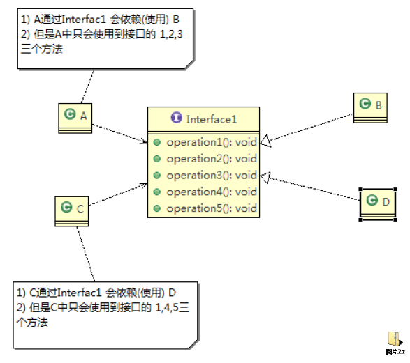
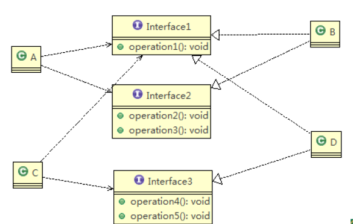

设计模式

## 设计模式的七个原则

### 设计模式的目的

编写软件的过程中，程序员面临着来自**耦合性、内聚性**以及**可维护性、可拓展性、重用性、灵活性**等多方面的挑战，设计模式是为了让程序具有更好的

1. **代码重用性**  *即：相同功能的代码，不用多次编写*
2. **可读性**  *即：编程规范性，便于其他程序员的阅读和理解*
3. **可拓展性**
4. **可靠性**
5. 使程序呈现**高内聚，低耦合**的特性

### 设计模式的七大原则

设计模式的七大原则有

- 单一职责原则
- 接口隔离原则
- 依赖倒转(倒置)原则
- 里氏转换原则
- 开闭原则
- 迪米特法则
- 合成服用原则

#### 单一职责原则

  > 对类来说的，
  > 即一个类应该只负责一项职责。

##### 单一职责原则注意事项和细节

* 降低类的复杂度，一个类只负责一项职责 。

* 提高类的可读性，可维护 性

* 降低变更引起的风险

  > 通常情况下，我们应当遵守单一职责原则 ，只有逻辑足够简单，才可以在代码级违反单一职责原则；只有类中方法数量足够少，可以在方法级别保持单一职责原则

#### 接口隔离原则(Interface Segregation Principle)

> 基本介绍：客户端不应该依赖它不需要的接口，即一个类对另一个类的依赖应该建立在最小的接口上

类A通过接口Interface1依赖类B，类C通过接口Interface1依赖类D，如果接口Interface1对于类A和类C来说不是最小接口，那么类B和类D必须去实现他们不需要的方法。

按照接口隔离原则应当这样处理：将接口Interface1拆分为独立的几个接口，类A和类C分别与他们需要的接口建立依赖关系。也就是采用接口隔离原则。

